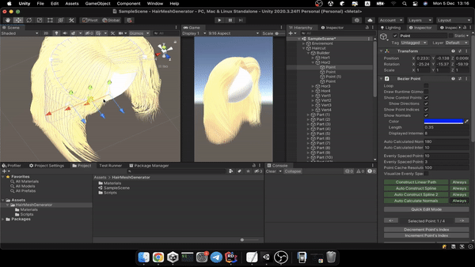
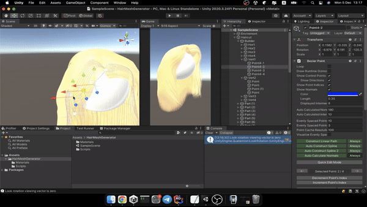
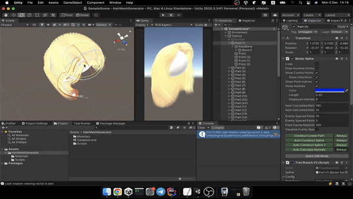
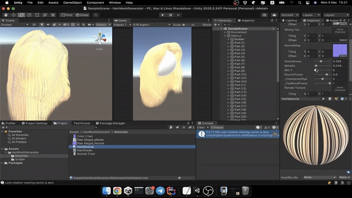

## Overview
HairMeshGenerator - Prof of concept for generating hair as skinned mesh in Unity3d.
It uses bezier curve as tools for describing shape of hair.

## Preview
### Horizontal mesh generation/correction:

### Vertical mesh generation/correction:

### Bone Preview:

### Shader Grow Preview (Based on UV2 chanel):

